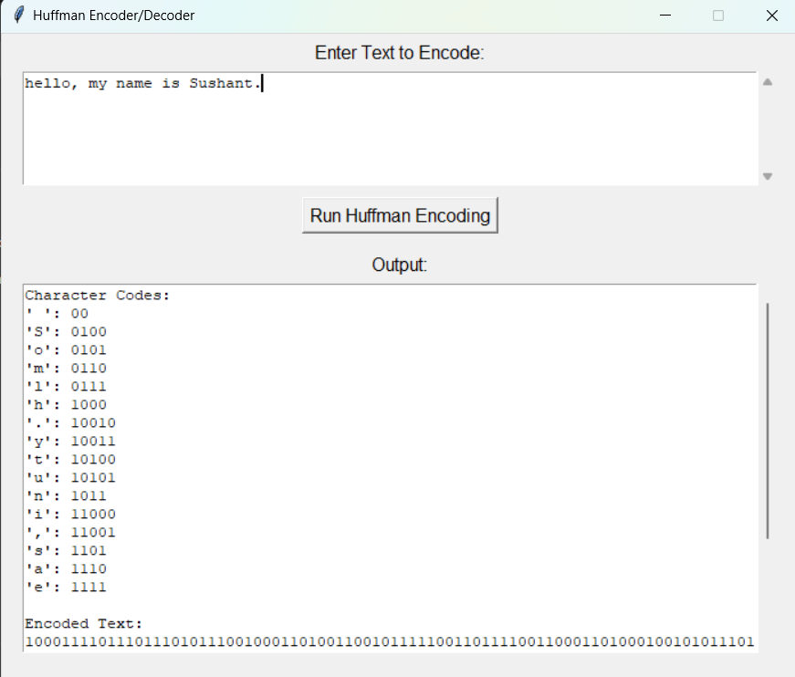

# 📜 Huffman_encoding
This project implements Huffman Encoding and Decoding in Python with a GUI interface using Tkinter.
Huffman coding is a lossless data compression algorithm that assigns variable-length codes to characters based on their frequencies. Characters that occur more frequently get shorter codes, which helps in reducing the total size of the data.


---
# 🛠️ Features

- Build Huffman Tree from input text.
- Generate Huffman codes for each character.
- Encode the text to a compressed binary string.
- Decode the binary string back to the original text.
- Display original and encoded bit counts for comparison.

---
# 💻 Technologies Used

- Python 3.x – Programming language
- Tkinter – GUI framework
- heapq – Min-heap for efficient Huffman tree construction
- collections.Counter – Counting character frequencies

# 📂 Project Structure
```bash
huffman_encoding/
├── .gitignore
├── LICENSE
├── README.md
├── huffman.py
└── output.png

```

---
## 🚀 Huffman Encoding – Installation & Setup

### 📥 1. Clone the Repository

```bash
git clone https://github.com/sushantfokmare/huffman_encoding.git
cd huffman_encoding
```

---

### 📦 2. Install Tkinter

```bash
pip install tk
```

> If that doesn't work, try:

```bash
pip install python-tk
```

---

### ▶️ 3. Run the Project

```bash
python huffman.py
```

---

### ✍️ 4. Usage:

- Enter any text in the input box.
- Click Run Huffman Encoding.
- View character codes, encoded text, decoded text, and bit statistics in the output box.

---

## 🖼️ Output Screenshot



## 👨‍💻 Developed By
**Sushant Fokmare**  
